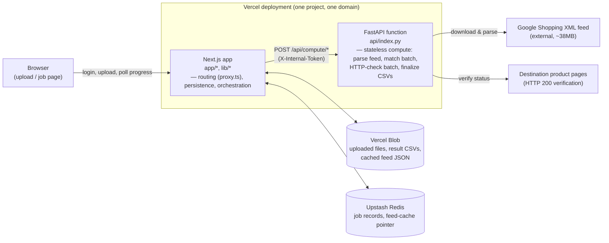

# Automated 404 URL Recovery for VTEX

Internal tool that maps broken (404) URLs to active product pages by cross-referencing legacy URLs against a live Google Shopping XML feed, and generates VTEX-ready `301` redirect files. Built to reduce Google Search Console crawl errors and recover lost SEO equity after catalog/URL restructures.

## Contents

- [Architecture](#architecture)
- [Tech stack](#tech-stack)
- [Matching engine](#matching-engine)
- [Project layout](#project-layout)
- [Installation](#installation)
- [Usage](#usage)
- [Deploying to Vercel](#deploying-to-vercel)
- [Testing](#testing)
- [Continuous integration](#continuous-integration)
- [Known limitations](#known-limitations)

## Architecture

The matching pipeline (feed download, fuzzy matching hundreds of rows, HTTP-checking hundreds of destination URLs) routinely runs far longer than a single serverless invocation should — especially on Vercel's Hobby plan, which caps function duration well below what a full run needs. Rather than run one long job, the system is split into a **stateless compute layer** and a **stateful orchestrator**:



- **`api/index.py` (compute layer)** holds no state. Every request carries the current `JobState` as JSON; every response carries the updated one. It does the CPU/network-bound work: parsing the ~38MB feed, fuzzy-matching a batch of rows, checking a batch of destination URLs, building the final CSVs.
- **`app/` + `lib/` (orchestrator)** is what the browser actually talks to. It owns persistence (Vercel Blob for uploaded files and result CSVs, Upstash Redis for job records) and drives the compute layer forward one bounded batch at a time via `POST /backend/jobs/:id/advance`, called repeatedly by the browser while a job page is open.
- **`proxy.ts`** gates every Next.js page/route behind a shared-password session cookie. It does **not** cover `api/index.py` — that function is reachable directly, so its endpoints are instead protected by a shared-secret header (`X-Internal-Token`, checked against `INTERNAL_API_TOKEN`) that only the Next.js backend knows.

This is a deliberate trade-off: two runtimes in one repo, coordinated over HTTP, instead of one long-running process — to fit within serverless invocation limits without needing a queue or a separate long-lived worker.

## Tech stack

| Layer | Technology | Purpose |
|---|---|---|
| Frontend | Next.js 16 (App Router), React 19, TypeScript | Upload form, job progress page, run history |
| Frontend styling | Hand-written CSS (design tokens in `app/globals.css`) | No CSS framework dependency |
| Backend orchestration | Next.js Route Handlers (`app/backend/*`) | Auth, job lifecycle, calls into the compute layer |
| Compute | Python 3.12, FastAPI (ASGI) | Stateless matching/HTTP-check/export steps |
| Matching | `rapidfuzz`, `pandas`, custom rules (`core/matching.py`) | Legacy/exact/fuzzy slug matching with a numeric-token guard |
| File storage | Vercel Blob (`@vercel/blob`) | Uploaded spreadsheets, result CSVs, cached feed JSON |
| Job state | Upstash Redis (`@upstash/redis`) | Job records, run history index, feed-cache pointer |
| Auth | Custom cookie session (`lib/session.ts`) + `proxy.ts` middleware | Single shared password, no user accounts |
| Local dev storage | File-based stand-in (`lib/localStore.ts`) | Runs the full flow with zero cloud setup via `LOCAL_DEV_STORAGE=true` |
| Testing | `pytest` (Python), `next build` (TypeScript type-checking) | See [Testing](#testing) |
| CI | GitHub Actions (`.github/workflows/ci.yml`) | Runs both test suites on every push/PR |
| Hosting | Vercel (Next.js + Python Functions, single deployment) | See [Deploying to Vercel](#deploying-to-vercel) |

There is no database beyond the two managed Vercel integrations above, no message queue, and no container orchestration — the whole system is two serverless runtimes plus two managed storage services, sized for the actual load (occasional, human-triggered batch jobs, not continuous traffic).

## Matching engine

- **Legacy rule**: URLs containing `-p12345`-style legacy product IDs redirect to `/superoferta`.
- **Exact slug match**: slugs extracted from 404 URLs are matched 1:1 against active slugs from the feed.
- **Fuzzy match**: Levenshtein-based similarity (`rapidfuzz`) against active slugs, default `90%` threshold. Candidates whose slugs disagree on a numeric token (model number, screen size, storage, etc.) are rejected even when the text is otherwise near-identical — `smart-tv-lg-50-polegadas` never matches `smart-tv-lg-55-polegadas`.
- **Minimum accuracy floor**: no match — of any type — reaches the final export below `match_score = 80`. Enforced server-side (`core/config.MIN_MATCH_SCORE`); the CLI `--threshold` flag and the web UI's threshold field cannot lower it.
- **Same-URL loop prevention**: a match where `from == to` is flagged `Same_URL_Ignored` and excluded, avoiding `ERR_TOO_MANY_REDIRECTS`.
- **HTTP 200 verification**: destination URLs are checked concurrently (`ThreadPoolExecutor` locally / batched in the API); only verified `200` destinations reach the final VTEX import file.
- **Output**: `redirects.csv` (VTEX import format — `from;to;type;endDate`) with only verified matches, plus `redirects_review.csv` with full diagnostics (`match_type`, `match_score`, `status_code`) for SEO audit.

## Project layout

```text
core/               Matching engine — plain Python, no web/CLI concerns
├── config.py           RecoveryConfig, MIN_MATCH_SCORE
├── feed.py              feed download/parsing
├── text_utils.py         encoding fixes (nested percent-encoding, etc.)
├── matching.py            legacy / exact / fuzzy rules
├── http_check.py           HTTP 200 verification
├── export.py                 CSV output
└── pipeline.py                orchestration: one-shot + resumable/batched

api/index.py         Stateless FastAPI compute function (see Architecture)
cli.py              Standalone one-shot CLI entrypoint over core/
app/                Next.js app: upload / job / history pages
├── backend/            Route handlers: auth, job lifecycle, orchestration
└── globals.css           Design tokens + component styles

lib/                Next.js backend support
├── blob.ts             Vercel Blob wrapper (+ local-dev fallback)
├── kv.ts                 Upstash Redis wrapper (+ local-dev fallback)
├── localStore.ts           File-based Blob/Redis stand-in for local dev
├── pythonCompute.ts          Client for api/index.py
├── feedCache.ts                Feed parse-result caching
└── session.ts                   Login session cookie

proxy.ts            Next.js middleware — gates all pages/routes behind login
tests/              pytest suite covering core/ and api/
```

## Installation

```bash
git clone https://github.com/fabricio-hunt/vtex-seo-redirect-automation.git
cd vtex-seo-redirect-automation

python -m venv .venv
# Windows: .venv\Scripts\activate   |   Linux/Mac: source .venv/bin/activate
pip install -r requirements.txt

npm install
```

The Python runtime is pinned to **3.12** via `.python-version` (matching Vercel's default) — recreate the virtualenv on 3.12 if your local interpreter differs.

## Usage

### Web UI (primary interface)

Two processes, both required for local development:

```bash
# Terminal 1 — Python compute function
uvicorn api.index:app --reload --port 8000

# Terminal 2 — Next.js app
npm run dev
```

Copy `.env.example` to `.env.local` and fill in `APP_PASSWORD`, `SESSION_SECRET`, and `INTERNAL_API_TOKEN` (any random strings for local dev, e.g. `openssl rand -hex 32`). `PYTHON_API_BASE_URL=http://localhost:8000` (already the default) points the Next.js backend at the local FastAPI process.

**Testing without real Vercel Blob / Upstash Redis:** set `LOCAL_DEV_STORAGE=true` in `.env.local`. Uploaded files, job records, and the feed cache are then written to `.local-data/` on disk (`lib/localStore.ts`) instead of calling the real cloud services, so the full upload → progress → download → history flow works with zero cloud setup. **Never set this in a real deployment** — on Vercel each request can land on a different, ephemeral container, so anything written this way vanishes between steps of the same job. Unset it once real Blob/Redis are provisioned.

> `uvicorn --reload` has a known issue when the process is started by a coding agent on Windows (no attached console for `CTRL_C_EVENT` → the worker silently keeps serving old code after a "Reloading..." log line). See `KNOWN_ISSUES.md` for the confirmed root cause and workaround.

### CLI (one-shot, no web UI)

```bash
python cli.py --input 404-gsc/Tabela.csv --output-dir output
```

Run `python cli.py --help` for the full flag list (`--xml-url`, `--threshold`, `--no-http-check`, `--max-workers`). Writes `output/redirects.csv` and `output/redirects_review.csv`.

## Deploying to Vercel

1. Push to GitHub/GitLab/Bitbucket and import the repo in the Vercel dashboard (or `vercel deploy`). Root Directory stays the repo root — it contains both the Next.js app (`app/`, `package.json`) and the Python function (`api/index.py`).
2. **Storage** (Project → Storage):
   - Add a **Blob** store and connect it → sets `BLOB_READ_WRITE_TOKEN` automatically.
   - Add **Upstash for Redis** (Marketplace integration) and connect it → sets `UPSTASH_REDIS_REST_URL` / `UPSTASH_REDIS_REST_TOKEN` automatically.
3. **Environment variables** (Project → Settings → Environment Variables), each generated with e.g. `openssl rand -hex 32`:
   - `APP_PASSWORD` — the shared login password.
   - `SESSION_SECRET` — signs the login cookie.
   - `INTERNAL_API_TOKEN` — shared secret the Next.js backend sends to `api/index.py`. This matters: `api/index.py` is *not* covered by `proxy.ts`, so without this check it would be reachable by anyone with the deployment URL.
4. Deploy, then confirm `GET /api/health` returns `{"status": "ok", ...}` before trusting the deployment — see the routing note below.
5. **Check the timeout budget for your plan.** Built assuming the Hobby plan's short per-invocation limit, so `app/backend/jobs/[id]/advance/route.ts` processes work in small batches (150 rows / 60 URLs per call) rather than all at once. `vercel.json` declares `maxDuration: 60` for `api/index.py`, but your plan may cap this lower — the most likely call to time out is the very first `parse-feed`, which downloads the full ~38MB feed in one shot.

### Why `vercel.json` needs an explicit routing rule

This project has **two** things at the repo root that could each be a Vercel "framework": the Next.js app (`package.json`) and the Python function (`api/index.py`). Vercel resolves this as a Next.js project with an auxiliary file-based Python function, **not** as Vercel's zero-config FastAPI preset — that preset only auto-routes every `/api/*` sub-path to a single function when Python *is* the project's root framework. Here, file-based routing applies instead, and by itself it maps `api/index.py` to the single literal path `/api` — not to `/api/health`, `/api/compute/match-batch`, or any of the other sub-paths the FastAPI app actually defines and that `lib/pythonCompute.ts` calls.

Without a routing rule, those sub-path requests 404 at Vercel's edge before ever reaching FastAPI — while working perfectly in local dev, since running `uvicorn api.index:app` directly lets FastAPI's own router see every request. `vercel.json` closes that gap explicitly:

```json
{
  "routes": [{ "src": "/api/(.*)", "dest": "api/index.py" }]
}
```

This forwards the full original request (path included) to the function, letting FastAPI's own router match `/api/health`, `/api/compute/*`, etc. as declared in `api/index.py`. `vercel.json` also excludes files the compute function never reads at runtime (`app/`, `tests/`, `node_modules/`, tracked `.csv`/`.xml`/`.xlsx` fixtures) from its bundle via `excludeFiles`, since Python functions on Vercel bundle everything reachable at build time with no automatic tree-shaking.

**This routing fix has not been exercised against a live Vercel deployment yet** — verify with a preview deploy and a direct request to `/api/health` and `/api/compute/load-input` before relying on it in production.

### A note on result file access

Downloaded CSVs (`redirects.csv`, `review.csv`) and the cached feed are stored in Vercel Blob with public, unguessable URLs. The app itself is gated by login, but anyone who obtains one of those exact URLs (e.g. from logs) could fetch that one file without logging in. Acceptable for an internal tool, but worth knowing.

## Testing

- **Python** (`core/` matching logic + `api/index.py` compute endpoints): `pytest tests/`.
- **Web** (`app/`, `lib/`): `npm run build` — Next.js type-checks the whole app as part of the production build; there's no separate `tsc --noEmit` step needed.

## Continuous integration

`.github/workflows/ci.yml` runs both suites above — `pytest` (on Python 3.12, matching Vercel's default) and the Next.js build — on every push/PR to `main`/`master`.

## Known limitations

Tracked in detail in `KNOWN_ISSUES.md`; the current open items:

- End-to-end confirmation that the latest matching fixes reduce real VTEX import failures is still pending a fresh production run.
- `localBlobPut()` in `lib/localStore.ts` (local-dev job CSVs) isn't yet written atomically, unlike `kv.json` — a small residual risk under OneDrive-synced project directories.
- The `vercel.json` routing fix described above has not been verified against an actual Vercel deployment.

## Notes

- `AGENTS.md` / `CLAUDE.md` at the repo root are auto-generated by `next dev` (Next.js 16 writes agent-facing notes about its own breaking changes) — regenerated on every dev run, safe to ignore or commit.
- This is an internal tool (`"license": "UNLICENSED"` in `package.json`) built for VTEX store administrators and technical SEO specialists at Bemol — not published or licensed for external use.
